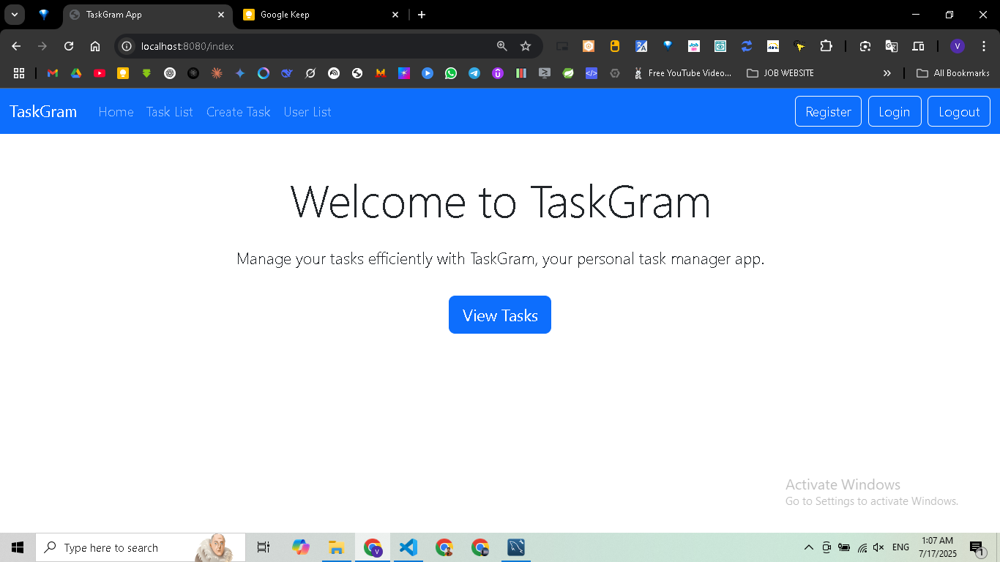
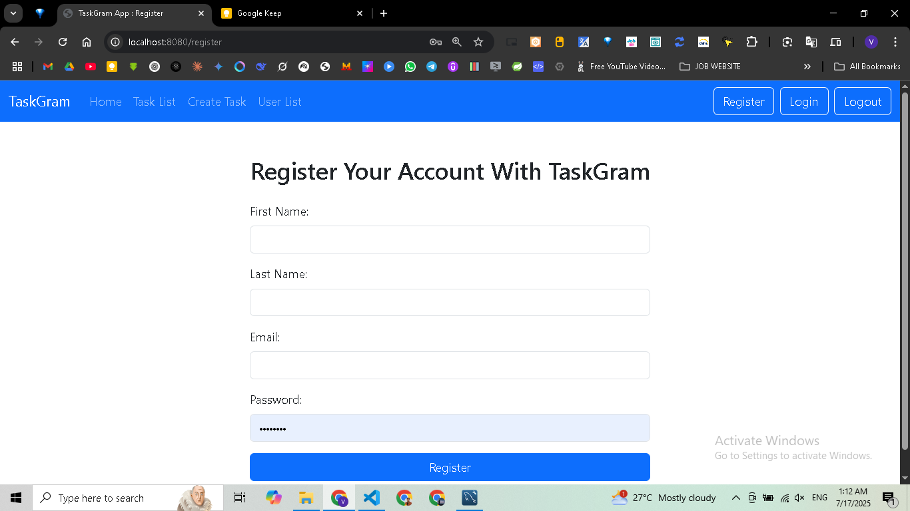
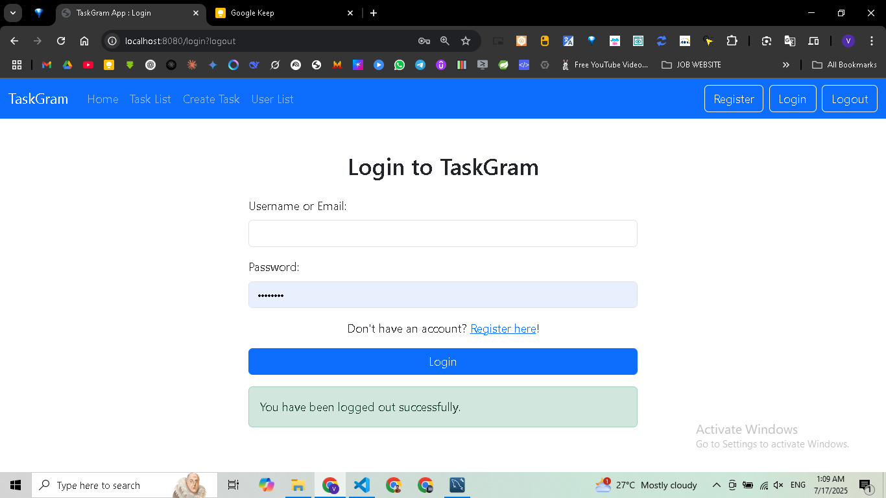
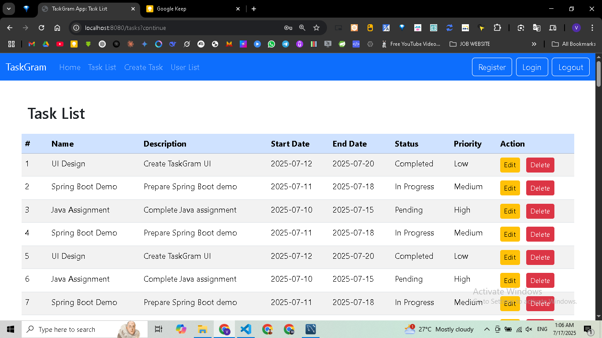
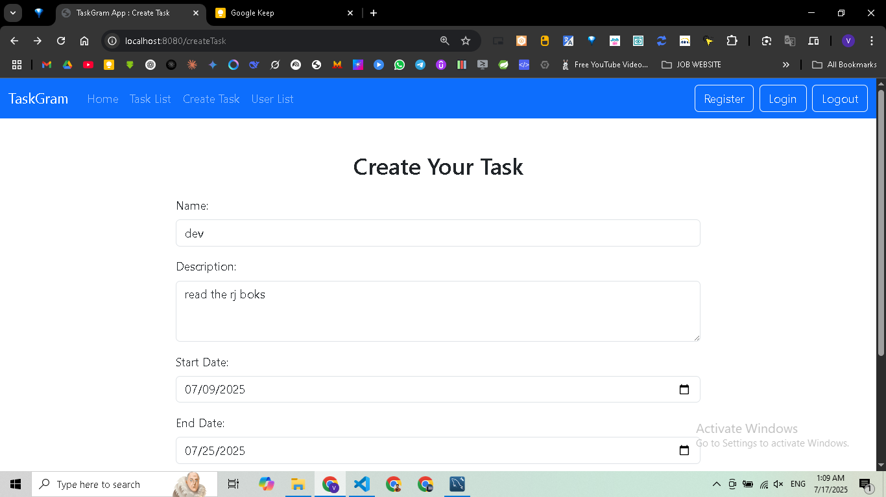

# TaskGram - Task Manager Application

TaskGram is a Java Spring Boot web app for managing tasks with user registration, login, and CRUD operations.

## Features

- User registration and login with validation and duplicate email checks.
- View, create, edit, and delete tasks.
- Task details include name, description, start date, end date, status, and priority.
- Responsive UI built with Bootstrap for a clean and user-friendly experience.

## Screenshots

### Home Page


### User Registration


### User Login


### Task List


### Create Task


## Getting Started

### Prerequisites

- Java 17 or higher
- Maven 3.6 or higher

### Running the Application

1. Clone the repository.
2. Navigate to the project directory.
3. Build the project using Maven:
   ```
   mvnw clean install
   ```
4. Run the application:
   ```
   mvnw spring-boot:run
   ```
5. Open your browser and go to `http://localhost:8080` to access TaskGram.

## Project Structure

- `src/main/java/com/ved/taskgram` - Java source code including controllers, services, entities, and security.
- `src/main/resources/templates` - Thymeleaf HTML templates for the UI.
- `src/main/resources/static` - Static resources like CSS and JavaScript.
- `ss` - Screenshots of the application UI.

## Database Configuration

TaskGram uses a MySQL database to store user and task data. The database connection is configured in the `application.properties` file with the following settings:

- Database URL: `jdbc:mysql://localhost:3306/taskgramdb?createDatabaseIfNotExist=true`
- Username: `root`
- Password: `password`
- Driver: `com.mysql.cj.jdbc.Driver`
- Hibernate Dialect: `MySQL8Dialect`
- Hibernate DDL Auto: `update` (automatically updates the database schema)

Make sure you have MySQL installed and running on your local machine. The application will create the database `taskgramdb` if it does not exist.

## License

This project is licensed under the MIT License.

